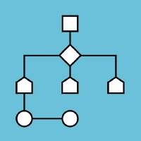

# Algorithm Solution

## Directory

  
- Link : [BaekJoon](https://www.acmicpc.net/)
- List : [List]()

  
- Link : [LeetCode](https://leetcode.com/)
- List : [List](https://github.com/SubAkBa/Algorithm_Solution/tree/master/LeetCode)

  
- Link : [Programmers](https://programmers.co.kr/learn/challenges)
- List : [List](https://github.com/SubAkBa/Algorithm_Solution/tree/master/Programmers)
  

- Link : [SWEA](https://swexpertacademy.com/main/main.do)
- List : [List](https://github.com/SubAkBa/Algorithm_Solution/tree/master/SWEA)
  
## Blog
### My Algorithm Solution Blog
- Link : [Blog](https://soobarkbar.tistory.com/category/Algorithm)
  
## Study
### 일주일에 다섯 문제 (모두의 연구소 풀잎스쿨)

  
- Introduction : [[11기]](https://home.modulabs.co.kr/product/a-week-five-questions/) [[12기]](https://home.modulabs.co.kr/product/%EC%9D%BC%EC%A3%BC%EC%9D%BC%EC%97%90-%EB%8B%A4%EC%84%AF-%EB%AC%B8%EC%A0%9C/)
- 문제 리스트 : [Link](https://docs.google.com/spreadsheets/d/1u5rXhoHpvc1IjI2aonndvyEzTkJ8JN2Jitiie2vDkPw/edit#gid=0)

### Al-Large Algorithm Study

- Repository : [Link](https://github.com/al-large)
- 문제 리스트 : [Link](https://docs.google.com/spreadsheets/d/19qrkHvZPDxogTZF9mLFWQMc1VffeZZVPJmt0PDksNCU/edit#gid=0)
